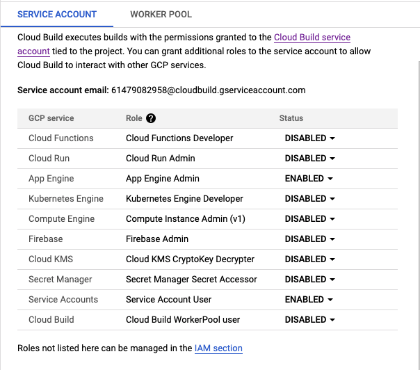
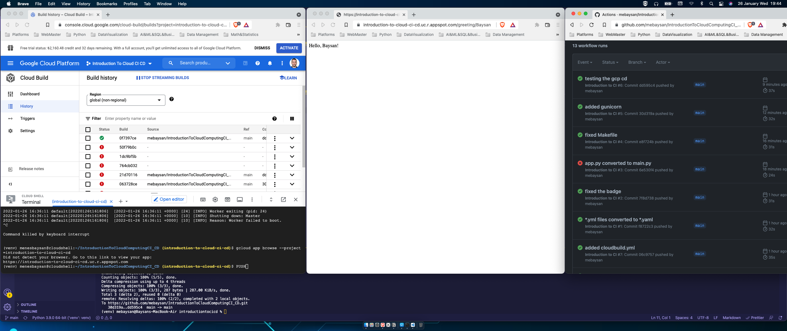

# Introduction

\#duke-cloud-computing-for-data

I created this repo to finish the task given me by Noah Gift from Duke University's [Building Cloud Computing Solutions at Scale Specialization](https://www.coursera.org/specializations/building-cloud-computing-solutions-at-scale)

# What Continuous Integration is

It provides the following:

- We can know our software. Is it working or not? What is it?
- It saves our time

# What Continuous Delivery is

We can provide the code is always in a deployable state. 

# About the Project

I created a basic Flask app for this project. Then I created a workflow for its Continuous Integration. When I succeed in the automatical workflow to continuous integration, I deployed the project on Google Cloud Platform: App Engine. I did continuous delivery by using Google Cloud Platform's Cloud Build.

# Step by Step

## What to do Before Start a Project

**Actually, I used Python. Therefore, I will be giving examples based on Python.**

We need to follow the steps below before starting any project:

- Create a `requirements.txt` file
- Create a `Makefile` file
- Create a virtual environment

## Roadmap for Creating CI & CD on GCP
We see the roadmap to create CI & CD on GCP below.
- Create a repo on GitHub
- Create a workflow on GitHub for Continuous Integration
- Create an app on GCP by using App Engine
  - Deploy the app
- Create a trigger to track push events on GitHub by using Cloud Build on GCP
  - Bind the push event and trigger

## First Step: Creating Continuous Integration Workflow on GitHub

Actually, we can implement this step to each project. We can use GitHub Actions to check our code passed the tests or not etc, even we don't use GCP.

We need to create `.yaml` files for creating workflows. We created [main.yaml](./.github/workflows/main.yaml) for this project. When we push the repo to GitHub, the repo automatically will do the steps which we wrote in the yaml file.

## Second Step: Creating an App on GCP

As aforementioned, I used GCP. When we are dealing with GCP App Engine, we need to create `app.yaml` file. We created this [app.yaml](./app.yaml) file for this project.

We use `gcloud app create` command to create an app by using App Engine and `gcloud app deploy` command to deploy an app on App Engine. App Engine setup itself by using `app.yaml` file.

## Third Step: Creating a Trigger with Cloud Build on GCP

If we setup the CI workflow and deploy the app, we need to create a trigger to track the repo's updates on GitHub. And we can do this with Cloud Build on GCP. In this section, we need to bind the code repo and trigger on Cloud Build's dashboard page. Then we have to enable some services in Cloud Build app. We do this to create communication between the services.

Cloud Build uses the `cloudbuild.yaml` file. We need to create it in the repo's folder. We created this [cloudbuild.yaml](./cloudbuild.yaml) for this project.

If we set up everything like mentioned above, we succeed in creating the CI & CD process.

I will be writing on these topics in the following days. You could follow me on [Medium](https://mebaysan.medium.com/).

Regards.

# Final Project

